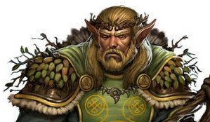
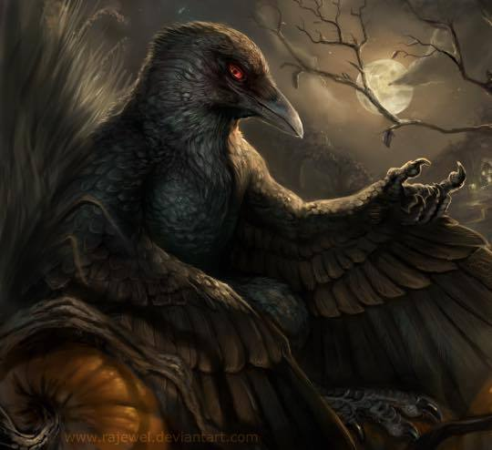

# Session 15 - Whiskey and warewolves

*Day 12, Sunday afternoon*.

After defeating the green dragon the party decied to loot the corpse for any valuable items.

Alan decied to search through the druids and doesn't find anything of note to loot, however, their shoulder plates do have a magical quality to them.

*Druids mantle: +2 AC when in beast shape. Shoulder pads*.

Ingemar knowing that chimera anuses are of great value, dragon anuses must be of even more. Rushing for the back side of the dragon Ingemar clumsily butchers the anus and manages to tear through the middle.

Picking at the rest of the carcus the group manage to aquire:

* Two meter square dragon skin
* 16 young green dragon talons
* Young dragon plates (1ft sq)
* Full young dragon skull
* Premium cuts of dragon steaks
* Chimera anus skin of dragon's blood

During the skinning the parties druid attempts to gather the dragon's poison glands and knicks it with his dagger. Swiftly moving to the side he dogdes the acid spilling forward.

Managing to take the whole dragon head the party have to wrap it up in their fine clothes and attach it to the sadles of the horses.

After this encounter the party decide to take a short rest and regain their strength. Taking this time Ingemar tries to befriend his horse Ase, but to no avail. Ase turns away from Ingemar with a look of distrust. The rest of the party try to calm Ase and turn her mind to like Ingemar, instead they realise that the horse is just an asshole.

As the party prepair to camp for the night, just after the sun has set the party hear a loud raven call. Another call, and another until the night air is filled with the sound of raven calls. Flying from a tree to the south the party see a large swarm of ravens fly towards the camp. At the edge of the camp the swarm dispurse and a single bird/human lands on the floor in front of them.

**Brazmil** - Wareraven, The kindness of the ravens.

He is seeking our help as there is trouble in the valley. Travel north to the one out of place pine tree where a lychan coven resides. He wishes us to eradicate these warewolves.

Moving back towards Kastiliborg the party notice that accross the river there is a lone pine tree standing out of place. Noting that this must be the pine tree Brazmil talked of the party attempt to cross the river.

Ingemar flies over to the other side of the river with one side of the rope and ties it to the pine tree. The rest of the party try to wade accross the river using the rope to support against the strength of the river. Alan, Tonttu, Erp and Leena all fail against the rushing water. Alan turns himself into a Giant Octopus saving Leena and Tonttu pulling them to the side of the river. Missing Erp at first Alan then travels down the river and attempts to pull him to the side of the river.

After a battle against the river tides the party manage to get accross the other side of the river.

The party decied to camp out and recover for the rest of the day, heading out in the evening.

The party head into the dungeon behind the pine tree and notice a skull in the rock with obvious canine features 100 ft up. The party head up towards this skull shape and it slowly reveals itself to be the entrance of a cave.

---

## Dungeon

On watch at the mouth of the dungeon stands two feral looking females weilding spears.

Moving to the left hand side of the cave the parties Sorcerer makes a shout appear from the right hand side of the cave. The two move over there and shout down the tunnel "Oy was that any of you?".

Quickly the sorcerer responses, "No...". The females turn looking right at the party and turn into the well known images of warewolves.

### Battle - Warewolves

