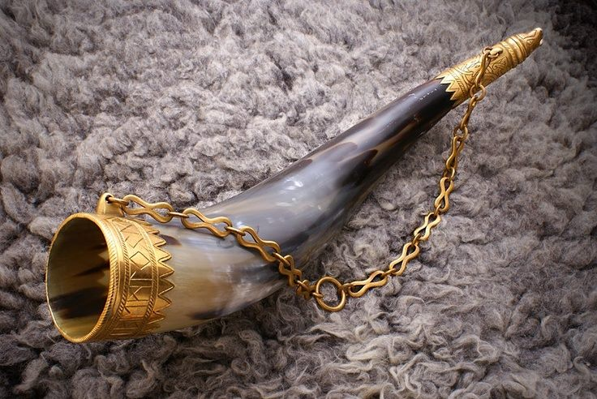
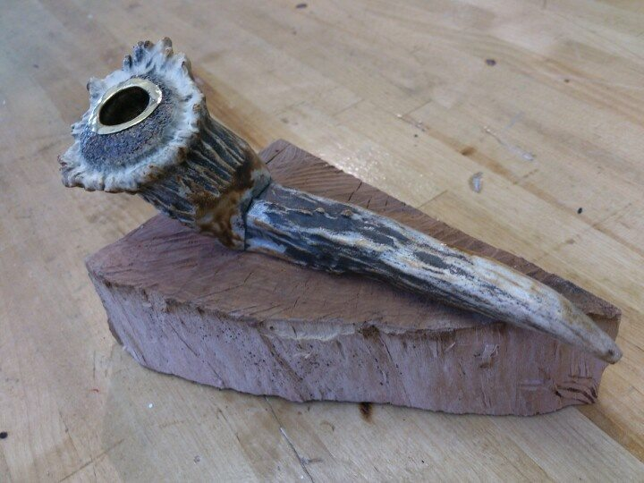

# Session 17 -

*Day 16, Thursday*.

After leaving a message with the Yarl the group decided to sell the rest of their Dragon wears. Kydos takes this time to collect his horn and pipe.

Scowering through the markets the rest of the party come across a hunter female Wood-Elf that is interested in buying their stock.

Items sold:

- Dragon Talons: 130gp
- Dragon skull with teeth: 230gp

The huntress told the party that she wouldn't buy the parties dragon blood but suggested that they go to a blacksmith to see if they will embue a weapon with powers.

Deciding to talk to the blacksmith Arngeir, who has done work for the party before, they ask if he knows what the dragons blood could do with a weapon. He says that it can be infused into a weapon to give it special properties but he is not a master in this art. This being said he could take the blood and work it into a Great Axe for Hamming for 85gp. (2 days for the Great Axe)

Long with the Great Axe Leena asks about making Dragon Plate Plate Armor. Interested by this and seeing that the party have aquired all of the nessesery parts Arngeir has agreed to make it within a week for 600gp.

After purchasing the armor Leena and Alan head to Rennin's to purchase some new diamonds to repay Erp. Talking with a previous aquaintance Leena asks for 900gp worth of diamonds. She managed to get a deal and purchased them for 875gp.

Aproaching noon the party head towards the castle to discuss the ECG with the Yarl. The Yarl did not meet the group and as such Ingemar asked that the Yarl give us a time to see him to pass along the information.

Heading back to The Manticore's Tail the group decied to continue interogating the assassin.

- Gilalpa hideout is based in the large houses at the harbour nearest to the town walls
- Grouping of houses around a courtyard, possibly one than one way in or out
- There are guards within their ranks that work for the ECG
- The ECG have sway over the Yarl in one way or another
- Arnulf is in contact with the Steward
- The guild can get to her if she is sent to prison
- The guild control the docks, the brothels and these places are where most of the money is made.
- To seaze power the people to take out would be Osvif, Gudfrid, Arnulf and Tore.

> Conversation for the Yarl: An assassination attempt came from Gilalpa, do you know if the a criminal organisation have a foothold within Kastaliborg. We will gather more information and let you know what we find out as we don't take this attack lightly and assume you don't want this within your city.

## Things to do next session

The Steward will be attacking thr party tonight (or at least we think he will send someone). The party will be resting and await the attack tonight.