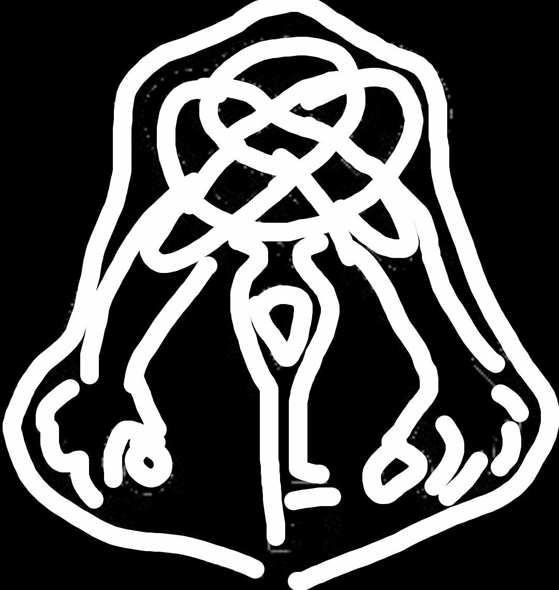

# Session 18 - Thieve's downfall

*Thursday (Evening). Day 52. Week 8 of campaign. 4th week of March*.

Making a plan to rest the night all together the party stay together in the top two rooms within the Manticore's Tail, taking turns to stay out on watch for any attacks.

Nothing comes of the evening and the party awake the next morning planning to attack the ECG in Kastaliborg around 9:30/10 am which should be the late night for the ECG members.

In waiting for the perfect time to start the raid Alan made his way to the Yarl's castle. On returning he informed the party of his conversation. The Yarl has said that if we can remove the ECG from Efrelyand then he will add 2000 gp to the budget for the keep at Kolssonafel. We must bring as many armor crests to the Yarl to prove we have taken out the ECG.

Along with this we must find out who within the guard and within the Yarls service are with the ECG.

As 10am hits the party head out towards the sewers lead by Leena and Alan looking out for the ECG markings. Heading through the sewers Leena follows the theievs cant and finds a hole in the wall which leads to the ECG hideout.

## ECG Kastaliborg battle

TODO: Add hideout battle map images

ECG Crest Total: 23

Enemies killed:

- 3 archers
- 5 assassins
- 2 master assassins

Items looted

- Star saphire (1000gp)
- 139 gp
- 4 poison viles
- Series of letters the detail the communication between Arnulf and Releal (Incriminating)
- Ornate key to open a vault in the ECG hideout (Other side is in Gilalpa)

## End of battle

Clearing out the thieve's guild the party explore around trying to find information about Releals communication with the ECG. Within Arnulf's chambers they find some incriminating documents that point to Releal helping the ECG move goods and take control within Kastalibourg.

Working their way through the gideout they find a large open room with a large ornaite chest in the center. There are two key holes in the chest, placing the one found in Arnulf's quaters Leena attempts to pick the other lock but to no avail, they will need to get the key from Gilapa.