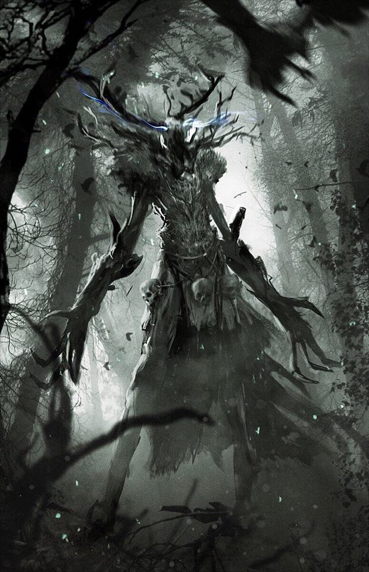

# Session 20 - The Leshen Lesson

*Sunday. Day 55. Week 8 of campaign. 4th week of March*.

Seeing the shamanic shrine Alan decieds to investigate and see what this shrine is for. The shirne itself was a collection of old bone with moss growing over, a large stag head placed a top and a platform in the center.

Alan notices two cross shaped bones with a does head to the eft and right of the shrine. Walkign towards this stag shrine and looks up into a tree to see dozens of ravens looking towards the party. Moving forward the ravens all fly towards Alan, collect together and a creature rises from the center; a Leshen .

The Leshen attacks the party, standing 12ft tall this monster towers over the party protecting his land. Along side this wooden goliath growl three dire wolves spawned from thin air. During the battle this giant creature could teleport around and summon more wolves to help in the battle.

After the battle Alan realises that as he was walking up to the shrines first and was attacked by the Leshen he may have been cursed by these shrines. Resting up for the night to regain their strength the party set out again for the Hill Giant tribe.